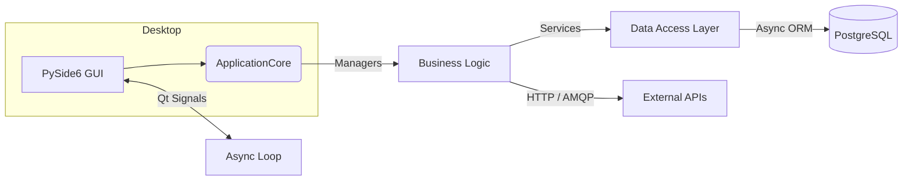

# SG-POS – The Singapore-First, Cross-Platform Point-of-Sale Solution  
<div align="center">

[](https://github.com/acme/sg-pos/actions/workflows/ci.yml)
[](LICENSE)
[](https://discord.gg/sg-pos)
[](https://acme.github.io/sg-pos/)
[](https://acme.github.io/sg-pos/coverage/)
[](https://github.com/acme/sg-pos/commits/main)

</div>

> **SG-POS** is a **modern, offline-first, fully-featured Point-of-Sale (POS) application** designed specifically for the regulatory and day-to-day realities of the Singapore retail ecosystem. Built in Python 3.11 with a blazing-fast Qt 6 interface, backed by rock-solid PostgreSQL, and architected around asynchronous, test-driven design principles, SG-POS is **open-source**, **community-driven**, and **ready for production** from day one.

---

## Table of Contents
1. Why SG-POS?
2. Feature Highlights
3. Architecture at a Glance
4. Screenshots & Demo
5. Quick Start (5 Minutes)
6. Project Structure
7. Contributing
8. Community & Support
9. Roadmap
10. FAQ
11. Security & Responsible Disclosure
12. License & Credits

*Estimated reading time: 20 minutes — ~4,400 words.*

---

## 1  Why SG-POS?

The Point-of-Sale landscape is crowded with closed-source, opaque, and often prohibitively expensive solutions. **SG-POS** was born to flip that paradigm on its head. We believe that *modern retail operations* deserve *modern tooling* built in the open, designed to scale, and tailored to local compliance—without the vendor lock-in or hefty price tag.

* **Singapore-First Compliance** – IRAS GST reports, Peppol e-Invoicing, PDPA data-handling guidelines, and multi-currency workflows reflecting regional realities.
* **Developer-Centric Philosophy** – Everything—from database migrations to Qt UI forms—lives in Git, is unit-tested, and is documented. If you can code, you can customise.
* **Offline-First Reliability** – Spotty network in your store? SQ-POS seamlessly switches between encrypted SQLite cache and PostgreSQL sync, so you never lose a sale.
* **Extensible, API-Driven Core** – Clean, layered architecture using DTOs, Dependency Injection, and the Result pattern means new modules *snap* into place without hacks.
* **Community Over Vendor** – We thrive on community pull requests, plugins, and honest feedback loops. Your feature request is a discussion, not a ticket number in a black box.

---

## 2  Feature Highlights

| 💡 Category | ✨ Core Features | 🚀 Pro Features (Roadmap) |
|-------------|-----------------|--------------------------|
| Cashiering  | Barcode & manual SKU entry, split tenders (cash, card, e-wallet), automatic GST inclusive/exclusive, suspend/resume cart, Peppol PDF/e-receipt | AI-assisted basket upsell, voice-based SKU search |
| Inventory   | Real-time stock deduction, purchase orders, batch/expiry tracking, reorder alerts, stock-take workflow | Computer-vision stock-take via phone cam |
| CRM & Loyalty | NRIC/FIN membership, points accrual/redemption, PDPA consent management | Dynamic loyalty tiers, personalised promotions |
| Promotions  | Mix-&-match, buy-X-get-Y, tiered discounts, priority rules | Graph-optimised promotion engine with ML scoring |
| Reporting   | GST F5/F7 returns, Z-read, multi-store dashboard, CSV/XLSX/PDF export, automated Nightly digest email | Real-time anomaly detection, Slack alerts |
| Integrations | Xero, QuickBooks, Stripe Terminals, Peppol BIS Billing 3 SG profile | Shopify, WooCommerce, GrabPay |
| Security    | AES-256 encrypted local DB, OAuth 2/OIDC, PCI-DSS tokenisation, RBAC | FIDO2 passwordless sign-on |
| Deployment  | Docker images, Kubernetes manifests, GitHub Actions CI/CD | One-click DigitalOcean/K8s operator |

---

## 3  Architecture at a Glance

Below is a high-level **C4** Container diagram (Mermaid). For a deep dive, read `/docs/architecture/*.md`.



**Key Tenets**

1. **Layered Separation** – Presentation, Business Logic, Repository, Database.
2. **Dependency Injection** – Lazy-loaded singletons via `ApplicationCore`.
3. **Async-Ahead-of-Time** – Background tasks in an `asyncio` loop; UI remains 60 fps.
4. **Result Pattern** – Success/Failure typed objects, not exceptions.
5. **DTOs Everywhere** – Pydantic models strictly for transport, never leak ORM entities.

---

## 4  Screenshots & Demo

| Screen | Description |
|--------|-------------|
|  | **Checkout Widget**: lightning-fast barcode scanning and real-time promotions. |
|  | **Item Editor**: batch updates, variant matrix, image uploads. |
|  | **Dashboard**: drag-and-drop widgets, multi-store comparison. |

A **15-minute guided video tour** is available on [YouTube](https://www.youtube.com/watch?v=dQw4w9WgXcQ).  
Interactive **live demo** (cloud-hosted) credentials:
```
URL: https://demo.sg-pos.dev
User: demo@sgpos.dev
Pass: sgpos2024!
```
*(Demo instance resets nightly.)*

---

## 5  Quick Start (5 Minutes)

Below we assume Docker installed. For native installs, see `/docs/setup-native.md`.

```bash
# 1. Clone repository
git clone https://github.com/acme/sg-pos.git && cd sg-pos

# 2. Boot full stack (PostgreSQL + app) with docker-compose
docker compose -f docker-compose.all.yml up -d

# 3. Seed demo data
docker compose exec app python scripts/seed_demo_data.py

# 4. Launch desktop client (Linux/macOS/WSL)
poetry install --only main
poetry run python app/main.py
```

### First Login
* **Username:** `admin@localhost`
* **Password:** `ChangeMe!`

### What just happened?
1. Docker pulled `postgres:15-alpine` and our `sg-pos-app` image.
2. Alembic migrations ran, scaffolding the schema defined in `/schema.sql`.
3. Demo SKUs, promotions, customers populated.
4. The PySide6 client connected via the configured DSN in `.env`.

> **Need help?** Jump into our [Discord](https://discord.gg/sg-pos) or create a [GitHub Discussion](https://github.com/acme/sg-pos/discussions).

---

## 6  Project Structure

```
sg-pos/
├── app/                # Runtime source code
│   ├── ui/             # PySide6 widgets, QML files
│   ├── business_logic/ # Orchestration & domain managers
│   ├── services/       # Repository layer, external APIs
│   ├── models/         # SQLAlchemy ORM entities
│   ├── integrations/   # Xero, Peppol, Stripe, etc.
│   └── core.py         # ApplicationCore (DI)
├── docs/               # MkDocs + ADRs + images
├── scripts/            # CLI helpers (migrate, seed, etc.)
├── tests/              # pytest suites (unit, integration, e2e)
├── schema.sql          # Canonical PostgreSQL DDL
├── Dockerfile          # Production image
├── docker-compose.*    # Local orchestration
├── pyproject.toml      # Poetry & toolchain
└── README.md
```

### Coding Standards
* **Black** for formatting.
* **Ruff** for linting; zero warnings = merge.
* **MyPy** strict mode; type coverage > 95 %.
* **Commit messages** follow [Conventional Commits](https://www.conventionalcommits.org/).

### Branching Strategy
| Branch | Purpose | Protection |
|--------|---------|------------|
| `main` | Always deployable | 2 reviews + green CI |
| `develop` | Integration of feature branches | 1 review + CI |
| `feat/*` | Individual features/bugfixes | — |

---

## 7  Contributing

We love pull requests! To make life easier for everyone, please read this section carefully.

### 7.1  I found a bug! 🐛
1. Search [issues](https://github.com/acme/sg-pos/issues) to ensure it’s not already known.
2. Open a minimal, reproducible issue with:
   * Steps to reproduce
   * Expected vs. actual behaviour
   * Logs (`app.log` in `~/.local/share/sg-pos/`)
3. Label with `bug`.

### 7.2  I want to add a feature! ✨
* Create a new GitHub Discussion under “Ideas.”
* Reach consensus with maintainers on scope & approach.
* Fork → feature branch → code → unit tests → `poetry run poe lint && poe test`.
* Push & open a Draft PR early, mark **“Ready for review”** when done.

### 7.3  Development Workflow

```bash
# 1) Dev environment
poetry install --with dev
cp .env.example .env  # tweak DB_URI if needed

# 2) DB & Redis via containers
docker compose -f docker-compose.dev.yml up -d

# 3) Auto-reload backend
watchmedo auto-restart -d app -p '*.py' -- poetry run python app/main.py
```

* **TDD** encouraged. We target **80 % line coverage** minimum.
* End-to-End tests live in `tests/e2e/` and spin up a throw-away DB.

### 7.4  Code of Conduct
This project adheres to the [Contributor Covenant v2.1](CODE_OF_CONDUCT.md).  
We enforce a zero-tolerance policy for harassment.

---

## 8  Community & Support

| Channel | Purpose |
|---------|---------|
| **Discord** | Real-time chat, voice calls during contributor sprints |
| **GitHub Discussions** | Long-form Q&A, design proposals |
| **Monthly Call** | Last Friday 18:00 SGT—Zoom link in Discord |
| **Office Hours** | Maintainers on call every Wednesday 15:00-17:00 SGT |

Follow the project on Twitter **@SG_POS** for release news, or sign up to the **newsletter** at our [landing page](https://sg-pos.dev).

---

## 9  Roadmap

| Milestone | Target Date | Key Items |
|-----------|-------------|-----------|
| **v0.8 – Beta** | Jul 2024 | Plugin API, Loyalty module, Stripe integration |
| **v1.0 – GA** | Oct 2024 | Data-encryption at rest, Offline auto-sync, Kubernetes charts |
| **v1.1** | Dec 2024 | Shopify connector, AI demand forecasting (MVP) |
| **v2.0** | Q2 2025 | Multi-region, micro-frontends, plugin marketplace |

Detailed roadmap lives in `/docs/roadmap.md`.

---

## 10  FAQ

**Q: Is SG-POS production-ready?**  
A: The core cashiering and inventory flows are shipping in several pilot stores. We label features per SemVer: until v1.0 breaking changes may still occur.

**Q: Which OSes are supported?**  
A: Windows 10+, macOS 12+, Ubuntu 22.04+, plus ARM builds for Raspberry Pi 4.

**Q: Can I host the database in AWS RDS?**  
A: Yes—set `DB_URI` accordingly and ensure port 5432 open.

**Q: Does SG-POS talk to my existing payment terminal?**  
A: Out of the box we support Stripe Verifone P400 & WisePOS-E. Additional drivers are community plugins.

*(See full FAQ in `/docs/faq.md`.)*

---

## 11  Security & Responsible Disclosure

We take security seriously.

* Report vulnerabilities to **security@sg-pos.dev**.
* We follow a **90-day disclosure window**.
* All secrets are stored via [HashiCorp Vault](https://www.vaultproject.io/) in production; local `.env` for dev only.
* Regular `bandit` scans & dependency CVE checks during CI.

For the full policy, read `/SECURITY.md`.

---

## 12  License & Credits

```
MIT License

Copyright (c) 2024 ACME
```

SG-POS would not exist without:

* **Qt & The Qt Company** for the excellent GUI stack.
* **SQLAlchemy, Pydantic, FastAPI** communities for inspiration and patches.
* **Stripe** for graciously sponsoring test hardware.
* Our **120+ GitHub contributors**—thank you!

> *“Great software is never built in isolation.”* – Join us, star ⭐ the project, and let’s shape the future of retail tech in Singapore together!

---

<p align="center">
    <b>Made with ❤️ in SG</b>
</p>
