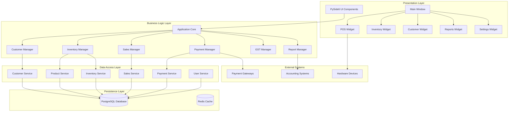
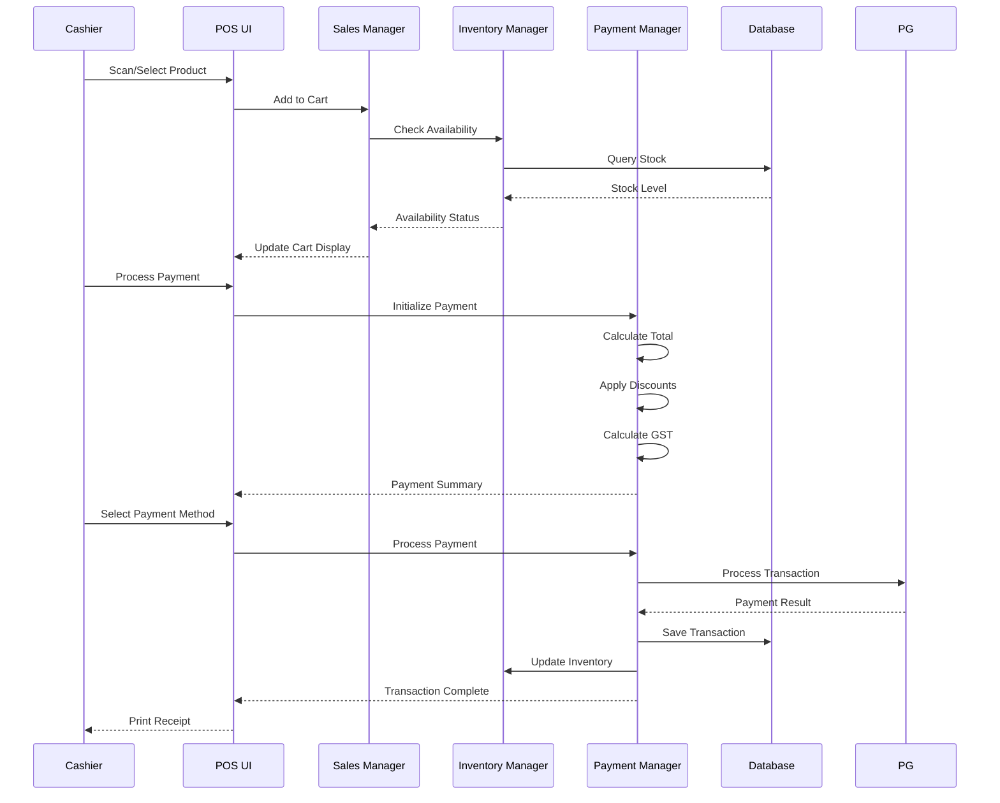
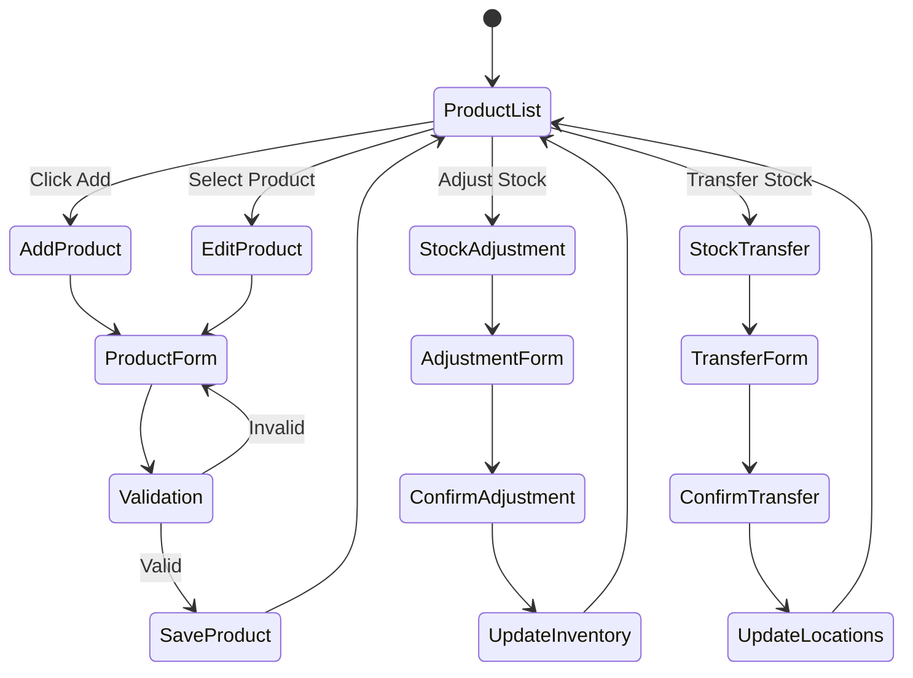

<think>
This is a comprehensive request for a Product Requirements Document (PRD) for a Singapore Point-of-Sale (POS) system. The user has provided detailed architectural considerations and requirements. I need to create a thorough PRD that includes:

1. Executive Summary
2. Product Overview
3. Technology Stack
4. Database Schema Design
5. Codebase File Hierarchy
6. Application Modules and User Interaction Diagram
7. Key Application Modules and Files Description
8. Development Environment Setup
9. Production Environment Setup
10. Architecture Details
11. Security Considerations
12. Testing Strategy
13. Deployment Strategy

The document needs to be at least 6000 words and should be comprehensive enough to guide the actual development without ambiguity. I'll need to incorporate the architectural considerations mentioned:
- Layered architecture with clear separation of concerns
- Dependency injection through ApplicationCore
- Asynchronous processing model
- Multi-currency support
- Singapore regulatory compliance

Let me structure this PRD systematically.
</think>

# Product Requirements Document: SG Point-of-Sale (POS) System

## Table of Contents
1. [Executive Summary](#executive-summary)
2. [Product Overview](#product-overview)
3. [Technology Stack](#technology-stack)
4. [System Architecture](#system-architecture)
5. [Database Schema Design](#database-schema-design)
6. [Codebase File Hierarchy](#codebase-file-hierarchy)
7. [Application Modules and User Interaction](#application-modules-and-user-interaction)
8. [Key Application Modules Description](#key-application-modules-description)
9. [Development Environment Setup](#development-environment-setup)
10. [Production Environment Setup](#production-environment-setup)
11. [Security Considerations](#security-considerations)
12. [Testing Strategy](#testing-strategy)
13. [Deployment Strategy](#deployment-strategy)
14. [Compliance and Regulatory Requirements](#compliance-and-regulatory-requirements)
15. [Performance Requirements](#performance-requirements)
16. [Future Enhancements](#future-enhancements)

## Executive Summary

The SG Point-of-Sale (POS) System is a comprehensive, cross-platform desktop application specifically designed for small to medium-sized businesses (SMBs) in Singapore. Built with modern technologies including Python, PySide6, and PostgreSQL, this system provides a professional-grade retail management solution that adheres to Singapore's regulatory requirements while offering exceptional performance and user experience.

The application architecture follows industry best practices with a clean layered architecture, robust asynchronous processing capabilities, and strong data integrity mechanisms. The system implements advanced patterns including Dependency Injection, Data Transfer Objects (DTOs), and the Result pattern to ensure maintainability, scalability, and reliability.

Key features include multi-currency support, GST compliance, comprehensive inventory management, customer relationship management, and detailed financial reporting capabilities. The system is designed to handle real-world business complexity while maintaining a user-friendly interface that requires minimal training.

## Product Overview

### Vision Statement
To provide Singapore's SMBs with a world-class point-of-sale system that combines powerful functionality with ease of use, enabling businesses to streamline operations, improve customer service, and maintain regulatory compliance effortlessly.

### Target Market
- Small to medium-sized retail businesses in Singapore
- Multi-location retail chains
- F&B establishments
- Service-based businesses requiring point-of-sale capabilities
- Businesses requiring GST compliance and reporting

### Core Value Propositions
1. **Singapore-Specific Compliance**: Built-in GST calculation, reporting, and submission features
2. **Multi-Currency Support**: Handle transactions in multiple currencies with real-time exchange rates
3. **Scalability**: Architecture designed to grow with the business
4. **Offline Capability**: Continue operations even without internet connectivity
5. **Real-Time Analytics**: Instant insights into business performance
6. **User-Friendly Interface**: Minimal training required for staff

### Key Features

#### Point of Sale Operations
- Fast and intuitive checkout process
- Barcode scanning support
- Multiple payment methods (cash, credit/debit cards, e-wallets, NETS)
- Split payment functionality
- Customer display integration
- Receipt printing and email capabilities
- Return and exchange processing
- Discount and promotion management

#### Inventory Management
- Real-time stock tracking
- Low stock alerts
- Automatic reorder points
- Batch and serial number tracking
- Product variants (size, color, etc.)
- Stock transfer between locations
- Stock take and adjustment features
- Supplier management

#### Customer Management
- Customer database with purchase history
- Loyalty program support
- Customer credit management
- Birthday and anniversary tracking
- Targeted marketing capabilities
- Customer feedback collection

#### Financial Management
- GST calculation and reporting
- Multi-currency transactions
- Daily cash reconciliation
- Profit and loss reporting
- Cash flow management
- Integration with accounting systems
- Expense tracking

#### Employee Management
- User roles and permissions
- Time clock functionality
- Commission tracking
- Performance reporting
- Shift management

#### Reporting and Analytics
- Sales reports (daily, weekly, monthly, yearly)
- Product performance analysis
- Customer behavior insights
- Employee performance metrics
- Inventory turnover reports
- GST reports for IRAS submission

## Technology Stack

### Core Technologies

#### Programming Language
- **Python 3.11+**: Chosen for its robust ecosystem, excellent library support, and rapid development capabilities
- Type hints throughout the codebase for better IDE support and code maintainability

#### GUI Framework
- **PySide6 (Qt for Python)**: Provides native look and feel across platforms
- Modern, responsive UI with hardware acceleration
- Extensive widget library for complex UI requirements
- Strong support for custom styling and theming

#### Database
- **PostgreSQL 15+**: Enterprise-grade relational database
- ACID compliance for data integrity
- Advanced indexing for performance
- JSON support for flexible data structures
- Full-text search capabilities

#### ORM
- **SQLAlchemy 2.0+**: Modern, powerful ORM with async support
- Database-agnostic design
- Migration support through Alembic
- Connection pooling for performance

### Supporting Technologies

#### Asynchronous Processing
- **asyncio**: Native Python async/await support
- **aiohttp**: Async HTTP client for external API calls
- **asyncpg**: High-performance async PostgreSQL driver

#### Data Validation
- **Pydantic**: Data validation using Python type annotations
- Automatic API documentation generation
- Serialization/deserialization support

#### Testing
- **pytest**: Comprehensive testing framework
- **pytest-asyncio**: Async test support
- **pytest-qt**: Qt/PySide6 testing utilities
- **pytest-cov**: Code coverage reporting

#### Development Tools
- **Black**: Code formatting
- **Ruff**: Fast Python linter
- **mypy**: Static type checking
- **pre-commit**: Git hooks for code quality

#### Deployment
- **PyInstaller**: Create standalone executables
- **Docker**: Containerization for consistent deployment
- **GitHub Actions**: CI/CD pipeline

#### External Integrations
- **Stripe API**: Credit card processing
- **NETS API**: Local payment gateway
- **Exchange Rate API**: Real-time currency conversion
- **IRAS API**: GST submission (when available)

## System Architecture

### Architectural Principles

#### 1. Layered Architecture
The system follows a strict layered architecture pattern with clear separation of concerns:

```
┌─────────────────────────────────────────┐
│         Presentation Layer              │
│    (PySide6 UI Components)              │
├─────────────────────────────────────────┤
│      Business Logic Layer               │
│    (Managers & Domain Logic)            │
├─────────────────────────────────────────┤
│      Data Access Layer                  │
│    (Services & Repositories)            │
├─────────────────────────────────────────┤
│      Persistence Layer                  │
│    (SQLAlchemy Models & PostgreSQL)     │
└─────────────────────────────────────────┘
```

#### 2. Dependency Injection
Central `ApplicationCore` class manages all dependencies using lazy initialization:

```python
class ApplicationCore:
    def __init__(self, config: Config):
        self._config = config
        self._db_engine = None
        self._session_factory = None
        # Managers initialized on demand
        
    @property
    def customer_manager(self) -> CustomerManager:
        if not hasattr(self, '_customer_manager'):
            self._customer_manager = CustomerManager(self)
        return self._customer_manager
```

#### 3. Asynchronous Processing Model
- Main thread handles UI interactions
- Separate thread runs asyncio event loop
- Background tasks for I/O operations
- Thread-safe communication via Qt signals

#### 4. Result Pattern
All operations return Result objects for explicit error handling:

```python
@dataclass
class Result[T]:
    success: bool
    data: Optional[T] = None
    error: Optional[str] = None
```

#### 5. Data Transfer Objects (DTOs)
Clean separation between database models and business objects:

```python
@dataclass
class CustomerDTO:
    id: Optional[int]
    name: str
    email: str
    phone: str
    address: str
    loyalty_points: int = 0
```

### Component Architecture

#### ApplicationCore
Central dependency container and application lifecycle manager:
- Lazy initialization of all managers
- Configuration management
- Database connection pooling
- Event bus for inter-component communication

#### Managers
Business logic orchestrators that coordinate between services:
- CustomerManager: Customer lifecycle and loyalty programs
- InventoryManager: Stock management and tracking
- SalesManager: Transaction processing and reporting
- PaymentManager: Payment processing and reconciliation
- GSTManager: Tax calculation and compliance
- ReportManager: Report generation and analytics

#### Services
Data access layer implementing repository pattern:
- CustomerService: CRUD operations for customers
- ProductService: Product catalog management
- TransactionService: Sales transaction persistence
- InventoryService: Stock level management
- ConfigurationService: System settings

#### UI Components
PySide6-based presentation layer:
- MainWindow: Application shell and navigation
- POSWidget: Point of sale interface
- InventoryWidget: Stock management UI
- CustomerWidget: Customer management interface
- ReportsWidget: Reporting and analytics dashboard
- SettingsWidget: Configuration interface

## Database Schema Design

### Core Tables

#### 1. System Tables

```sql
-- System configuration and settings
CREATE TABLE system_config (
    id SERIAL PRIMARY KEY,
    key VARCHAR(100) UNIQUE NOT NULL,
    value JSONB NOT NULL,
    description TEXT,
    created_at TIMESTAMP DEFAULT CURRENT_TIMESTAMP,
    updated_at TIMESTAMP DEFAULT CURRENT_TIMESTAMP
);

-- Audit log for all system changes
CREATE TABLE audit_log (
    id SERIAL PRIMARY KEY,
    table_name VARCHAR(100) NOT NULL,
    record_id INTEGER NOT NULL,
    action VARCHAR(20) NOT NULL, -- INSERT, UPDATE, DELETE
    user_id INTEGER NOT NULL,
    changes JSONB,
    created_at TIMESTAMP DEFAULT CURRENT_TIMESTAMP
);
```

#### 2. User Management Tables

```sql
-- System users and authentication
CREATE TABLE users (
    id SERIAL PRIMARY KEY,
    username VARCHAR(50) UNIQUE NOT NULL,
    email VARCHAR(255) UNIQUE NOT NULL,
    password_hash VARCHAR(255) NOT NULL,
    first_name VARCHAR(100) NOT NULL,
    last_name VARCHAR(100) NOT NULL,
    role_id INTEGER NOT NULL,
    is_active BOOLEAN DEFAULT TRUE,
    last_login TIMESTAMP,
    created_at TIMESTAMP DEFAULT CURRENT_TIMESTAMP,
    updated_at TIMESTAMP DEFAULT CURRENT_TIMESTAMP,
    FOREIGN KEY (role_id) REFERENCES roles(id)
);

-- User roles and permissions
CREATE TABLE roles (
    id SERIAL PRIMARY KEY,
    name VARCHAR(50) UNIQUE NOT NULL,
    description TEXT,
    permissions JSONB NOT NULL, -- Array of permission strings
    created_at TIMESTAMP DEFAULT CURRENT_TIMESTAMP
);

-- User sessions for security
CREATE TABLE user_sessions (
    id SERIAL PRIMARY KEY,
    user_id INTEGER NOT NULL,
    token VARCHAR(255) UNIQUE NOT NULL,
    ip_address INET,
    user_agent TEXT,
    expires_at TIMESTAMP NOT NULL,
    created_at TIMESTAMP DEFAULT CURRENT_TIMESTAMP,
    FOREIGN KEY (user_id) REFERENCES users(id)
);
```

#### 3. Customer Management Tables

```sql
-- Customer information
CREATE TABLE customers (
    id SERIAL PRIMARY KEY,
    customer_code VARCHAR(20) UNIQUE NOT NULL,
    company_name VARCHAR(255),
    first_name VARCHAR(100),
    last_name VARCHAR(100),
    email VARCHAR(255),
    phone VARCHAR(20),
    mobile VARCHAR(20),
    address_line1 VARCHAR(255),
    address_line2 VARCHAR(255),
    postal_code VARCHAR(10),
    country VARCHAR(2) DEFAULT 'SG',
    customer_type VARCHAR(20) DEFAULT 'RETAIL', -- RETAIL, WHOLESALE, VIP
    credit_limit DECIMAL(15,2) DEFAULT 0,
    current_balance DECIMAL(15,2) DEFAULT 0,
    loyalty_points INTEGER DEFAULT 0,
    tax_id VARCHAR(50), -- For B2B customers
    notes TEXT,
    is_active BOOLEAN DEFAULT TRUE,
    created_by INTEGER NOT NULL,
    created_at TIMESTAMP DEFAULT CURRENT_TIMESTAMP,
    updated_at TIMESTAMP DEFAULT CURRENT_TIMESTAMP,
    FOREIGN KEY (created_by) REFERENCES users(id)
);

-- Customer loyalty transactions
CREATE TABLE loyalty_transactions (
    id SERIAL PRIMARY KEY,
    customer_id INTEGER NOT NULL,
    transaction_type VARCHAR(20) NOT NULL, -- EARNED, REDEEMED, EXPIRED, ADJUSTED
    points INTEGER NOT NULL,
    reference_type VARCHAR(50), -- SALE, RETURN, MANUAL, PROMOTION
    reference_id INTEGER,
    description TEXT,
    created_by INTEGER NOT NULL,
    created_at TIMESTAMP DEFAULT CURRENT_TIMESTAMP,
    FOREIGN KEY (customer_id) REFERENCES customers(id),
    FOREIGN KEY (created_by) REFERENCES users(id)
);
```

#### 4. Product and Inventory Tables

```sql
-- Product categories
CREATE TABLE categories (
    id SERIAL PRIMARY KEY,
    name VARCHAR(100) NOT NULL,
    parent_id INTEGER,
    description TEXT,
    display_order INTEGER DEFAULT 0,
    is_active BOOLEAN DEFAULT TRUE,
    created_at TIMESTAMP DEFAULT CURRENT_TIMESTAMP,
    FOREIGN KEY (parent_id) REFERENCES categories(id)
);

-- Product information
CREATE TABLE products (
    id SERIAL PRIMARY KEY,
    sku VARCHAR(50) UNIQUE NOT NULL,
    barcode VARCHAR(50) UNIQUE,
    name VARCHAR(255) NOT NULL,
    description TEXT,
    category_id INTEGER,
    brand VARCHAR(100),
    unit_of_measure VARCHAR(20) DEFAULT 'PIECE',
    cost_price DECIMAL(15,2) NOT NULL,
    selling_price DECIMAL(15,2) NOT NULL,
    tax_rate DECIMAL(5,2) DEFAULT 8.0, -- GST rate
    is_taxable BOOLEAN DEFAULT TRUE,
    is_active BOOLEAN DEFAULT TRUE,
    track_inventory BOOLEAN DEFAULT TRUE,
    reorder_point INTEGER DEFAULT 0,
    reorder_quantity INTEGER DEFAULT 0,
    created_by INTEGER NOT NULL,
    created_at TIMESTAMP DEFAULT CURRENT_TIMESTAMP,
    updated_at TIMESTAMP DEFAULT CURRENT_TIMESTAMP,
    FOREIGN KEY (category_id) REFERENCES categories(id),
    FOREIGN KEY (created_by) REFERENCES users(id)
);

-- Product variants (size, color, etc.)
CREATE TABLE product_variants (
    id SERIAL PRIMARY KEY,
    product_id INTEGER NOT NULL,
    sku VARCHAR(50) UNIQUE NOT NULL,
    barcode VARCHAR(50) UNIQUE,
    variant_name VARCHAR(100) NOT NULL,
    attributes JSONB, -- {"size": "L", "color": "Blue"}
    cost_price DECIMAL(15,2),
    selling_price DECIMAL(15,2),
    is_active BOOLEAN DEFAULT TRUE,
    created_at TIMESTAMP DEFAULT CURRENT_TIMESTAMP,
    FOREIGN KEY (product_id) REFERENCES products(id)
);

-- Inventory tracking
CREATE TABLE inventory (
    id SERIAL PRIMARY KEY,
    product_id INTEGER NOT NULL,
    variant_id INTEGER,
    location_id INTEGER NOT NULL,
    quantity INTEGER NOT NULL DEFAULT 0,
    reserved_quantity INTEGER DEFAULT 0,
    last_updated TIMESTAMP DEFAULT CURRENT_TIMESTAMP,
    FOREIGN KEY (product_id) REFERENCES products(id),
    FOREIGN KEY (variant_id) REFERENCES product_variants(id),
    FOREIGN KEY (location_id) REFERENCES locations(id),
    UNIQUE(product_id, variant_id, location_id)
);

-- Inventory movements
CREATE TABLE inventory_movements (
    id SERIAL PRIMARY KEY,
    product_id INTEGER NOT NULL,
    variant_id INTEGER
```sql
-- Inventory movements (continued)
CREATE TABLE inventory_movements (
    id SERIAL PRIMARY KEY,
    product_id INTEGER NOT NULL,
    variant_id INTEGER,
    location_id INTEGER NOT NULL,
    movement_type VARCHAR(20) NOT NULL, -- PURCHASE, SALE, RETURN, ADJUSTMENT, TRANSFER
    quantity INTEGER NOT NULL,
    reference_type VARCHAR(50),
    reference_id INTEGER,
    cost_price DECIMAL(15,2),
    notes TEXT,
    created_by INTEGER NOT NULL,
    created_at TIMESTAMP DEFAULT CURRENT_TIMESTAMP,
    FOREIGN KEY (product_id) REFERENCES products(id),
    FOREIGN KEY (variant_id) REFERENCES product_variants(id),
    FOREIGN KEY (location_id) REFERENCES locations(id),
    FOREIGN KEY (created_by) REFERENCES users(id)
);

-- Store locations
CREATE TABLE locations (
    id SERIAL PRIMARY KEY,
    code VARCHAR(20) UNIQUE NOT NULL,
    name VARCHAR(100) NOT NULL,
    type VARCHAR(20) DEFAULT 'STORE', -- STORE, WAREHOUSE
    address TEXT,
    phone VARCHAR(20),
    is_active BOOLEAN DEFAULT TRUE,
    created_at TIMESTAMP DEFAULT CURRENT_TIMESTAMP
);
```

#### 5. Sales and Transaction Tables

```sql
-- Sales transactions
CREATE TABLE sales_transactions (
    id SERIAL PRIMARY KEY,
    transaction_number VARCHAR(50) UNIQUE NOT NULL,
    location_id INTEGER NOT NULL,
    customer_id INTEGER,
    transaction_date TIMESTAMP NOT NULL,
    subtotal DECIMAL(15,2) NOT NULL,
    tax_amount DECIMAL(15,2) NOT NULL,
    discount_amount DECIMAL(15,2) DEFAULT 0,
    total_amount DECIMAL(15,2) NOT NULL,
    paid_amount DECIMAL(15,2) DEFAULT 0,
    change_amount DECIMAL(15,2) DEFAULT 0,
    status VARCHAR(20) DEFAULT 'COMPLETED', -- DRAFT, COMPLETED, VOID, REFUNDED
    notes TEXT,
    created_by INTEGER NOT NULL,
    created_at TIMESTAMP DEFAULT CURRENT_TIMESTAMP,
    updated_at TIMESTAMP DEFAULT CURRENT_TIMESTAMP,
    FOREIGN KEY (location_id) REFERENCES locations(id),
    FOREIGN KEY (customer_id) REFERENCES customers(id),
    FOREIGN KEY (created_by) REFERENCES users(id)
);

-- Sales transaction items
CREATE TABLE sales_items (
    id SERIAL PRIMARY KEY,
    transaction_id INTEGER NOT NULL,
    product_id INTEGER NOT NULL,
    variant_id INTEGER,
    quantity INTEGER NOT NULL,
    unit_price DECIMAL(15,2) NOT NULL,
    discount_amount DECIMAL(15,2) DEFAULT 0,
    tax_amount DECIMAL(15,2) NOT NULL,
    total_amount DECIMAL(15,2) NOT NULL,
    cost_price DECIMAL(15,2) NOT NULL, -- For profit calculation
    notes TEXT,
    created_at TIMESTAMP DEFAULT CURRENT_TIMESTAMP,
    FOREIGN KEY (transaction_id) REFERENCES sales_transactions(id),
    FOREIGN KEY (product_id) REFERENCES products(id),
    FOREIGN KEY (variant_id) REFERENCES product_variants(id)
);

-- Payment records
CREATE TABLE payments (
    id SERIAL PRIMARY KEY,
    transaction_id INTEGER NOT NULL,
    payment_method VARCHAR(50) NOT NULL, -- CASH, CREDIT_CARD, DEBIT_CARD, NETS, PAYNOW, etc.
    amount DECIMAL(15,2) NOT NULL,
    currency_code VARCHAR(3) DEFAULT 'SGD',
    exchange_rate DECIMAL(10,6) DEFAULT 1.0,
    reference_number VARCHAR(100), -- For card/online payments
    status VARCHAR(20) DEFAULT 'COMPLETED', -- PENDING, COMPLETED, FAILED, REFUNDED
    processed_at TIMESTAMP,
    created_at TIMESTAMP DEFAULT CURRENT_TIMESTAMP,
    FOREIGN KEY (transaction_id) REFERENCES sales_transactions(id)
);

-- Cash drawer sessions
CREATE TABLE cash_sessions (
    id SERIAL PRIMARY KEY,
    location_id INTEGER NOT NULL,
    user_id INTEGER NOT NULL,
    opening_amount DECIMAL(15,2) NOT NULL,
    closing_amount DECIMAL(15,2),
    expected_amount DECIMAL(15,2),
    difference_amount DECIMAL(15,2),
    status VARCHAR(20) DEFAULT 'OPEN', -- OPEN, CLOSED
    opened_at TIMESTAMP NOT NULL,
    closed_at TIMESTAMP,
    notes TEXT,
    FOREIGN KEY (location_id) REFERENCES locations(id),
    FOREIGN KEY (user_id) REFERENCES users(id)
);
```

#### 6. Supplier and Purchase Tables

```sql
-- Supplier information
CREATE TABLE suppliers (
    id SERIAL PRIMARY KEY,
    supplier_code VARCHAR(20) UNIQUE NOT NULL,
    company_name VARCHAR(255) NOT NULL,
    contact_person VARCHAR(100),
    email VARCHAR(255),
    phone VARCHAR(20),
    address TEXT,
    payment_terms INTEGER DEFAULT 30, -- Days
    tax_id VARCHAR(50),
    is_active BOOLEAN DEFAULT TRUE,
    created_at TIMESTAMP DEFAULT CURRENT_TIMESTAMP,
    updated_at TIMESTAMP DEFAULT CURRENT_TIMESTAMP
);

-- Purchase orders
CREATE TABLE purchase_orders (
    id SERIAL PRIMARY KEY,
    po_number VARCHAR(50) UNIQUE NOT NULL,
    supplier_id INTEGER NOT NULL,
    order_date DATE NOT NULL,
    expected_date DATE,
    subtotal DECIMAL(15,2) NOT NULL,
    tax_amount DECIMAL(15,2) NOT NULL,
    total_amount DECIMAL(15,2) NOT NULL,
    status VARCHAR(20) DEFAULT 'DRAFT', -- DRAFT, SENT, PARTIAL, RECEIVED, CANCELLED
    notes TEXT,
    created_by INTEGER NOT NULL,
    created_at TIMESTAMP DEFAULT CURRENT_TIMESTAMP,
    updated_at TIMESTAMP DEFAULT CURRENT_TIMESTAMP,
    FOREIGN KEY (supplier_id) REFERENCES suppliers(id),
    FOREIGN KEY (created_by) REFERENCES users(id)
);

-- Purchase order items
CREATE TABLE purchase_order_items (
    id SERIAL PRIMARY KEY,
    po_id INTEGER NOT NULL,
    product_id INTEGER NOT NULL,
    variant_id INTEGER,
    quantity INTEGER NOT NULL,
    unit_price DECIMAL(15,2) NOT NULL,
    tax_amount DECIMAL(15,2) NOT NULL,
    total_amount DECIMAL(15,2) NOT NULL,
    received_quantity INTEGER DEFAULT 0,
    FOREIGN KEY (po_id) REFERENCES purchase_orders(id),
    FOREIGN KEY (product_id) REFERENCES products(id),
    FOREIGN KEY (variant_id) REFERENCES product_variants(id)
);
```

#### 7. Accounting Tables

```sql
-- Chart of accounts
CREATE TABLE accounts (
    id SERIAL PRIMARY KEY,
    account_code VARCHAR(20) UNIQUE NOT NULL,
    account_name VARCHAR(100) NOT NULL,
    account_type VARCHAR(20) NOT NULL, -- ASSET, LIABILITY, EQUITY, REVENUE, EXPENSE
    parent_id INTEGER,
    is_active BOOLEAN DEFAULT TRUE,
    created_at TIMESTAMP DEFAULT CURRENT_TIMESTAMP,
    FOREIGN KEY (parent_id) REFERENCES accounts(id)
);

-- Journal entries
CREATE TABLE journal_entries (
    id SERIAL PRIMARY KEY,
    entry_number VARCHAR(50) UNIQUE NOT NULL,
    entry_date DATE NOT NULL,
    description TEXT,
    reference_type VARCHAR(50),
    reference_id INTEGER,
    status VARCHAR(20) DEFAULT 'POSTED', -- DRAFT, POSTED, VOID
    created_by INTEGER NOT NULL,
    created_at TIMESTAMP DEFAULT CURRENT_TIMESTAMP,
    FOREIGN KEY (created_by) REFERENCES users(id)
);

-- Journal entry lines
CREATE TABLE journal_lines (
    id SERIAL PRIMARY KEY,
    entry_id INTEGER NOT NULL,
    account_id INTEGER NOT NULL,
    debit_amount DECIMAL(15,2) DEFAULT 0,
    credit_amount DECIMAL(15,2) DEFAULT 0,
    description TEXT,
    FOREIGN KEY (entry_id) REFERENCES journal_entries(id),
    FOREIGN KEY (account_id) REFERENCES accounts(id),
    CHECK (debit_amount >= 0 AND credit_amount >= 0),
    CHECK (NOT (debit_amount > 0 AND credit_amount > 0))
);
```

#### 8. GST and Tax Tables

```sql
-- GST configuration
CREATE TABLE gst_config (
    id SERIAL PRIMARY KEY,
    effective_date DATE NOT NULL,
    standard_rate DECIMAL(5,2) NOT NULL,
    zero_rated_categories JSONB, -- Array of category IDs
    exempt_categories JSONB, -- Array of category IDs
    is_active BOOLEAN DEFAULT TRUE,
    created_at TIMESTAMP DEFAULT CURRENT_TIMESTAMP
);

-- GST returns
CREATE TABLE gst_returns (
    id SERIAL PRIMARY KEY,
    period_start DATE NOT NULL,
    period_end DATE NOT NULL,
    box1_total_sales DECIMAL(15,2) NOT NULL, -- Total value of standard-rated supplies
    box2_total_purchases DECIMAL(15,2) NOT NULL, -- Total value of purchases
    box3_output_tax DECIMAL(15,2) NOT NULL, -- Output tax due
    box4_input_tax DECIMAL(15,2) NOT NULL, -- Input tax claimable
    box5_net_tax DECIMAL(15,2) NOT NULL, -- Net GST to be paid/claimed
    box6_total_exports DECIMAL(15,2) DEFAULT 0, -- Value of exports
    box7_total_exempt DECIMAL(15,2) DEFAULT 0, -- Value of exempt supplies
    status VARCHAR(20) DEFAULT 'DRAFT', -- DRAFT, SUBMITTED, ACCEPTED
    submission_date DATE,
    reference_number VARCHAR(50),
    created_by INTEGER NOT NULL,
    created_at TIMESTAMP DEFAULT CURRENT_TIMESTAMP,
    FOREIGN KEY (created_by) REFERENCES users(id)
);
```

### Database Indexes and Constraints

```sql
-- Performance indexes
CREATE INDEX idx_customers_email ON customers(email);
CREATE INDEX idx_customers_phone ON customers(phone);
CREATE INDEX idx_products_sku ON products(sku);
CREATE INDEX idx_products_barcode ON products(barcode);
CREATE INDEX idx_sales_date ON sales_transactions(transaction_date);
CREATE INDEX idx_sales_customer ON sales_transactions(customer_id);
CREATE INDEX idx_inventory_product ON inventory(product_id);
CREATE INDEX idx_audit_table_record ON audit_log(table_name, record_id);

-- Triggers for automatic timestamp updates
CREATE OR REPLACE FUNCTION update_updated_at_column()
RETURNS TRIGGER AS $$
BEGIN
    NEW.updated_at = CURRENT_TIMESTAMP;
    RETURN NEW;
END;
$$ language 'plpgsql';

CREATE TRIGGER update_customers_updated_at BEFORE UPDATE ON customers
    FOR EACH ROW EXECUTE FUNCTION update_updated_at_column();
    
CREATE TRIGGER update_products_updated_at BEFORE UPDATE ON products
    FOR EACH ROW EXECUTE FUNCTION update_updated_at_column();

-- Trigger for audit logging
CREATE OR REPLACE FUNCTION audit_trigger_function()
RETURNS TRIGGER AS $$
BEGIN
    IF TG_OP = 'INSERT' THEN
        INSERT INTO audit_log(table_name, record_id, action, user_id, changes)
        VALUES (TG_TABLE_NAME, NEW.id, TG_OP, current_setting('app.current_user_id')::INTEGER, row_to_json(NEW));
    ELSIF TG_OP = 'UPDATE' THEN
        INSERT INTO audit_log(table_name, record_id, action, user_id, changes)
        VALUES (TG_TABLE_NAME, NEW.id, TG_OP, current_setting('app.current_user_id')::INTEGER, 
                jsonb_build_object('old', row_to_json(OLD), 'new', row_to_json(NEW)));
    ELSIF TG_OP = 'DELETE' THEN
        INSERT INTO audit_log(table_name, record_id, action, user_id, changes)
        VALUES (TG_TABLE_NAME, OLD.id, TG_OP, current_setting('app.current_user_id')::INTEGER, row_to_json(OLD));
    END IF;
    RETURN NULL;
END;
$$ language 'plpgsql';

-- Apply audit triggers to critical tables
CREATE TRIGGER audit_customers AFTER INSERT OR UPDATE OR DELETE ON customers
    FOR EACH ROW EXECUTE FUNCTION audit_trigger_function();
    
CREATE TRIGGER audit_sales AFTER INSERT OR UPDATE OR DELETE ON sales_transactions
    FOR EACH ROW EXECUTE FUNCTION audit_trigger_function();
```

## Codebase File Hierarchy

```
sg-pos-system/
├── app/
│   ├── __init__.py
│   ├── main.py                          # Application entry point
│   ├── config.py                        # Configuration management
│   ├── constants.py                     # Application constants
│   ├── exceptions.py                    # Custom exceptions
│   ├── application_core.py              # Dependency injection container
│   │
│   ├── models/                          # SQLAlchemy ORM models
│   │   ├── __init__.py
│   │   ├── base.py                      # Base model class
│   │   ├── user.py                      # User and authentication models
│   │   ├── customer.py                  # Customer models
│   │   ├── product.py                   # Product and inventory models
│   │   ├── sales.py                     # Sales transaction models
│   │   ├── supplier.py                  # Supplier and purchase models
│   │   ├── accounting.py                # Accounting models
│   │   └── gst.py                       # GST and tax models
│   │
│   ├── dto/                             # Data Transfer Objects
│   │   ├── __init__.py
│   │   ├── base.py                      # Base DTO and Result classes
│   │   ├── customer_dto.py              # Customer DTOs
│   │   ├── product_dto.py               # Product DTOs
│   │   ├── sales_dto.py                 # Sales DTOs
│   │   ├── payment_dto.py               # Payment DTOs
│   │   └── report_dto.py                # Reporting DTOs
│   │
│   ├── services/                        # Data access layer
│   │   ├── __init__.py
│   │   ├── base_service.py              # Base service class
│   │   ├── customer_service.py          # Customer data operations
│   │   ├── product_service.py           # Product data operations
│   │   ├── inventory_service.py         # Inventory operations
│   │   ├── sales_service.py             # Sales data operations
│   │   ├── payment_service.py           # Payment processing
│   │   ├── supplier_service.py          # Supplier operations
│   │   ├── user_service.py              # User management
│   │   └── configuration_service.py     # System configuration
│   │
│   ├── business_logic/                  # Business logic layer
│   │   ├── __init__.py
│   │   ├── customer_manager.py          # Customer business logic
│   │   ├── inventory_manager.py         # Inventory management
│   │   ├── sales_manager.py             # Sales processing
│   │   ├── payment_manager.py           # Payment handling
│   │   ├── promotion_manager.py         # Promotions and discounts
│   │   ├── loyalty_manager.py           # Loyalty program
│   │   └── report_manager.py            # Report generation
│   │
│   ├── accounting/                      # Accounting module
│   │   ├── __init__.py
│   │   ├── gst_manager.py               # GST calculations
│   │   ├── journal_manager.py           # Journal entries
│   │   ├── ledger_manager.py            # General ledger
│   │   └── financial_reports.py         # Financial reporting
│   │
│   ├── ui/                              # Presentation layer
│   │   ├── __init__.py
│   │   ├── main_window.py               # Main application window
│   │
<think>
The user is right, I didn't complete the PRD. I need to continue from where I left off in the codebase file hierarchy and complete all the remaining sections according to the table of contents I provided. Let me continue from the UI section of the file hierarchy.
</think>

```
│   │   ├── ui/                              # Presentation layer (continued)
│   │   ├── __init__.py
│   │   ├── main_window.py               # Main application window
│   │   ├── styles.py                    # Application styling
│   │   ├── base_widget.py               # Base widget class
│   │   │
│   │   ├── pos/                         # Point of Sale UI
│   │   │   ├── __init__.py
│   │   │   ├── pos_widget.py            # Main POS interface
│   │   │   ├── product_grid.py          # Product selection grid
│   │   │   ├── cart_widget.py           # Shopping cart display
│   │   │   ├── payment_dialog.py        # Payment processing dialog
│   │   │   ├── customer_display.py      # Customer-facing display
│   │   │   └── receipt_preview.py       # Receipt preview/print
│   │   │
│   │   ├── inventory/                   # Inventory management UI
│   │   │   ├── __init__.py
│   │   │   ├── inventory_widget.py      # Main inventory interface
│   │   │   ├── product_editor.py        # Product add/edit dialog
│   │   │   ├── stock_adjustment.py      # Stock adjustment dialog
│   │   │   ├── stock_transfer.py        # Inter-location transfer
│   │   │   └── barcode_scanner.py       # Barcode scanning interface
│   │   │
│   │   ├── customers/                   # Customer management UI
│   │   │   ├── __init__.py
│   │   │   ├── customer_widget.py       # Customer list/search
│   │   │   ├── customer_editor.py       # Customer add/edit dialog
│   │   │   ├── loyalty_widget.py        # Loyalty program interface
│   │   │   └── customer_history.py      # Purchase history view
│   │   │
│   │   ├── reports/                     # Reporting UI
│   │   │   ├── __init__.py
│   │   │   ├── reports_widget.py        # Main reports interface
│   │   │   ├── sales_reports.py         # Sales report views
│   │   │   ├── inventory_reports.py     # Inventory reports
│   │   │   ├── financial_reports.py     # Financial statements
│   │   │   ├── gst_reports.py           # GST reporting
│   │   │   └── chart_widgets.py         # Data visualization
│   │   │
│   │   ├── settings/                    # Settings UI
│   │   │   ├── __init__.py
│   │   │   ├── settings_widget.py       # Main settings interface
│   │   │   ├── user_management.py       # User/role configuration
│   │   │   ├── tax_settings.py          # GST/tax configuration
│   │   │   ├── payment_settings.py      # Payment method setup
│   │   │   └── system_settings.py       # General system settings
│   │   │
│   │   └── components/                  # Reusable UI components
│   │       ├── __init__.py
│   │       ├── search_widget.py         # Universal search component
│   │       ├── data_table.py            # Enhanced table widget
│   │       ├── date_picker.py           # Date selection widget
│   │       ├── number_pad.py            # Numeric input pad
│   │       └── loading_overlay.py       # Loading indicator
│   │
│   ├── integration/                     # External integrations
│   │   ├── __init__.py
│   │   ├── payment_gateways/
│   │   │   ├── __init__.py
│   │   │   ├── base_gateway.py          # Abstract payment gateway
│   │   │   ├── stripe_gateway.py        # Stripe integration
│   │   │   ├── nets_gateway.py          # NETS integration
│   │   │   └── paynow_gateway.py        # PayNow integration
│   │   │
│   │   ├── accounting_sync/
│   │   │   ├── __init__.py
│   │   │   ├── quickbooks_sync.py       # QuickBooks integration
│   │   │   └── xero_sync.py             # Xero integration
│   │   │
│   │   └── hardware/
│   │       ├── __init__.py
│   │       ├── printer_manager.py       # Receipt printer interface
│   │       ├── cash_drawer.py           # Cash drawer control
│   │       ├── barcode_scanner.py       # Scanner integration
│   │       └── customer_display.py      # Customer display driver
│   │
│   └── utils/                           # Utility modules
│       ├── __init__.py
│       ├── async_utils.py               # Async helper functions
│       ├── validators.py                # Data validation utilities
│       ├── formatters.py                # Number/date formatting
│       ├── security.py                  # Security utilities
│       ├── backup.py                    # Database backup utilities
│       └── logger.py                    # Logging configuration
│
├── tests/                               # Test suite
│   ├── __init__.py
│   ├── conftest.py                      # Pytest configuration
│   ├── fixtures/                        # Test fixtures
│   │   ├── __init__.py
│   │   ├── database.py                  # Database fixtures
│   │   ├── models.py                    # Model fixtures
│   │   └── ui.py                        # UI test fixtures
│   │
│   ├── unit/                            # Unit tests
│   │   ├── __init__.py
│   │   ├── test_models/
│   │   ├── test_services/
│   │   ├── test_managers/
│   │   └── test_utils/
│   │
│   ├── integration/                     # Integration tests
│   │   ├── __init__.py
│   │   ├── test_payment_flow.py
│   │   ├── test_inventory_sync.py
│   │   └── test_reporting.py
│   │
│   └── e2e/                            # End-to-end tests
│       ├── __init__.py
│       ├── test_pos_workflow.py
│       └── test_full_transaction.py
│
├── scripts/                             # Utility scripts
│   ├── __init__.py
│   ├── init_db.py                       # Database initialization
│   ├── migrate_db.py                    # Database migrations
│   ├── seed_data.py                     # Development data seeding
│   ├── backup_db.py                     # Database backup script
│   └── generate_reports.py              # Batch report generation
│
├── resources/                           # Application resources
│   ├── images/                          # UI images and icons
│   ├── fonts/                           # Custom fonts
│   ├── templates/                       # Report templates
│   │   ├── receipt.html
│   │   ├── invoice.html
│   │   └── reports/
│   └── translations/                    # i18n files
│       ├── en_US.json
│       ├── zh_CN.json
│       └── ms_MY.json
│
├── docs/                                # Documentation
│   ├── api/                             # API documentation
│   ├── user_guide/                      # User manual
│   ├── admin_guide/                     # Administrator guide
│   └── developer_guide/                 # Developer documentation
│
├── deployment/                          # Deployment configurations
│   ├── docker/
│   │   ├── Dockerfile
│   │   └── docker-compose.yml
│   ├── kubernetes/
│   │   ├── deployment.yaml
│   │   └── service.yaml
│   └── installer/
│       ├── windows/
│       ├── macos/
│       └── linux/
│
├── .github/                             # GitHub configurations
│   ├── workflows/
│   │   ├── ci.yml                       # Continuous integration
│   │   ├── release.yml                  # Release automation
│   │   └── codeql.yml                   # Security scanning
│   └── ISSUE_TEMPLATE/
│
├── requirements/                        # Dependency specifications
│   ├── base.txt                         # Core dependencies
│   ├── dev.txt                          # Development dependencies
│   └── prod.txt                         # Production dependencies
│
├── .env.example                         # Environment variables template
├── .gitignore                           # Git ignore rules
├── .pre-commit-config.yaml              # Pre-commit hooks
├── pyproject.toml                       # Project configuration
├── README.md                            # Project documentation
├── LICENSE                              # License file
└── setup.py                             # Package setup
```

## Application Modules and User Interaction

### System Architecture Diagram



### User Interaction Flow

#### 1. Point of Sale Transaction Flow



#### 2. Inventory Management Flow



## Key Application Modules Description

### 1. Application Core (`app/application_core.py`)

The ApplicationCore serves as the central dependency injection container and application lifecycle manager. It implements lazy initialization for all managers and services, ensuring efficient resource usage.

```python
class ApplicationCore:
    """Central application container managing all dependencies and services."""
    
    def __init__(self, config: Config):
        self._config = config
        self._db_engine = None
        self._session_factory = None
        self._event_bus = EventBus()
        self._cache = None
        self._logger = self._setup_logging()
        
    @property
    def customer_manager(self) -> CustomerManager:
        """Lazy initialization of CustomerManager."""
        if not hasattr(self, '_customer_manager'):
            self._customer_manager = CustomerManager(self)
        return self._customer_manager
    
    @property
    def inventory_manager(self) -> InventoryManager:
        """Lazy initialization of InventoryManager."""
        if not hasattr(self, '_inventory_manager'):
            self._inventory_manager = InventoryManager(self)
        return self._inventory_manager
    
    @property
    def sales_manager(self) -> SalesManager:
        """Lazy initialization of SalesManager."""
        if not hasattr(self, '_sales_manager'):
            self._sales_manager = SalesManager(self)
        return self._sales_manager
    
    async def initialize(self):
        """Initialize core application components."""
        await self._init_database()
        await self._init_cache()
        await self._load_configuration()
        
    async def shutdown(self):
        """Graceful shutdown of application components."""
        await self._close_database()
        await self._close_cache()
```

### 2. Sales Manager (`app/business_logic/sales_manager.py`)

The SalesManager orchestrates the entire sales process, coordinating between inventory, payment, and customer management systems.

```python
class SalesManager:
    """Manages sales transactions and related business logic."""
    
    def __init__(self, app_core: ApplicationCore):
        self._app_core = app_core
        self._active_transactions: Dict[str, SalesTransaction] = {}
        
    async def create_transaction(self, user_id: int, location_id: int) -> Result[SalesTransactionDTO]:
        """Create a new sales transaction."""
        try:
            # Generate unique transaction number
            transaction_number = self._generate_transaction_number()
            
            # Create transaction object
            transaction = SalesTransaction(
                transaction_number=transaction_number,
                user_id=user_id,
                location_id=location_id,
                items=[],
                status=TransactionStatus.DRAFT
            )
            
            # Store in active transactions
            self._active_transactions[transaction_number] = transaction
            
            # Convert to DTO
            dto = self._to_dto(transaction)
            
            return Result(success=True, data=dto)
            
        except Exception as e:
            self._app_core.logger.error(f"Failed to create transaction: {e}")
            return Result(success
